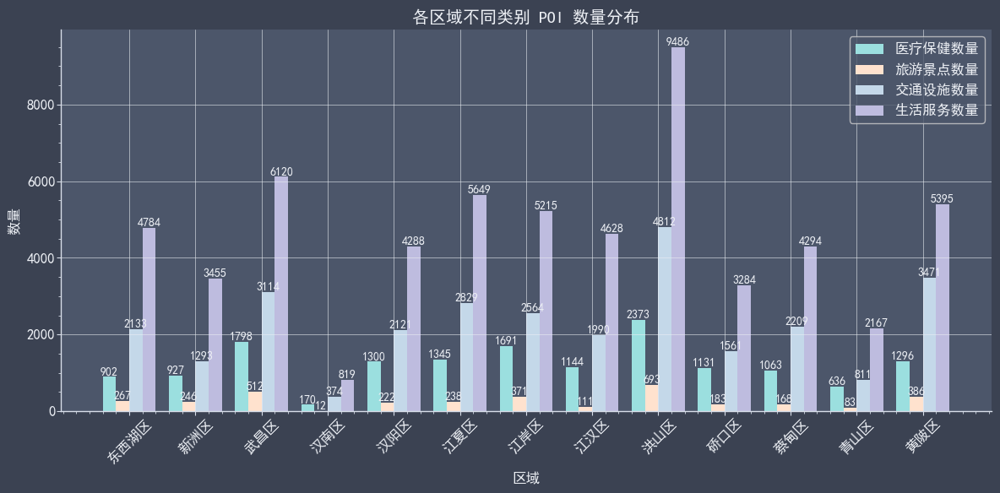
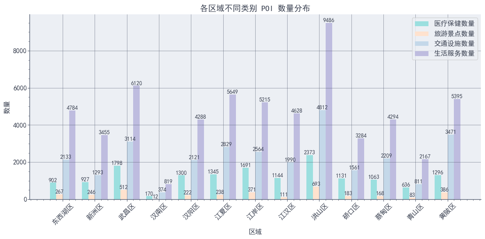

安装库：
```bash
pip install aquarel
```

设置主题：
```python
# 主题导入
from aquarel import load_theme

# aquarel 主题使用
theme = load_theme('arctic_light') # 亮色主题用 arctic_light
theme.apply()
theme.apply_transforms()
```

主题样式：


